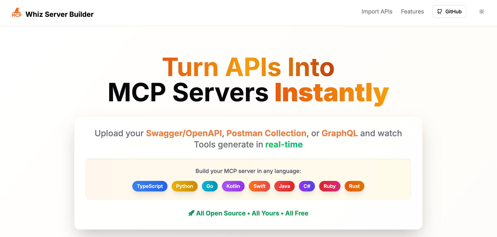
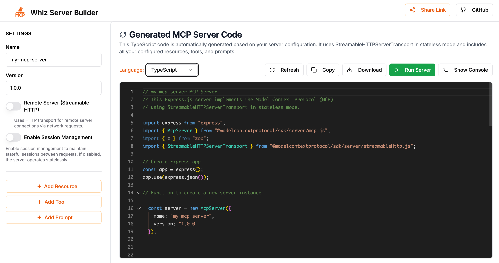

# 🪄🔮 MCPWHIZ - MCP Wizard Server Builder

Free, open-source tool to convert Swagger/OpenAPI, Postman Collections, GraphQL APIs, HAR files, and WSDL/SOAP services into Model Context Protocol (MCP) servers instantly. Generate production-ready TypeScript and Python code with a beautiful visual interface.




## Features

- **Visual Server Config Editor**: Intuitive UI to create and update server name, version, description, and more.
- **Resource, Tool, and Prompt Management**: Add, edit, import, and organize your server's resources, tools, and prompts.
- **API Import Wizards**: 
  - Import from **Swagger/OpenAPI**, **Postman**, **GraphQL**, **HAR files**, or **WSDL/SOAP** files/URLs.
  - Select which endpoints/resources/tools to import.
- **Live Code Preview**: Instantly see the generated server configuration code as you edit, and run it directly in the browser for testing.
- **Responsive Design**: Works great on desktop and mobile.
- **Modern UI**: Built with React, Next.js, and Radix UI components.

## Quick Start

1. **Install dependencies:**
   ```bash
   pnpm install
   ```

2. **Run the development server:**
   ```bash
   pnpm dev
   ```

3. **Open your browser:**
   Visit [http://localhost:3000](http://localhost:3000) for local development, or visit [https://mcpwhiz.com](https://mcpwhiz.com) to use the live version.

## Usage

- **Import APIs**: Use the import cards to bring in your Swagger, Postman, GraphQL, HAR, or WSDL/SOAP specs.
- **Edit Configuration**: Use the sidebar and modals to add or edit resources, tools, and prompts.
- **Preview & Test**: See your configuration in real-time, run it directly in the browser, and export as needed.


## Project Structure

- `app/` - Next.js app routes and pages
- `components/` - UI components (wizard, forms, dialogs, etc.)
- `store/` - State management for server config
- `lib/` - Utility functions

## Technologies Used

- [Next.js](https://nextjs.org/)
- [React](https://react.dev/)
- [Radix UI](https://www.radix-ui.com/)
- [Lucide Icons](https://lucide.dev/)
- TypeScript

## Contributing

Contributions are welcome! Please open issues or pull requests for bug fixes, features, or suggestions.

## License

[MIT](LICENSE)

